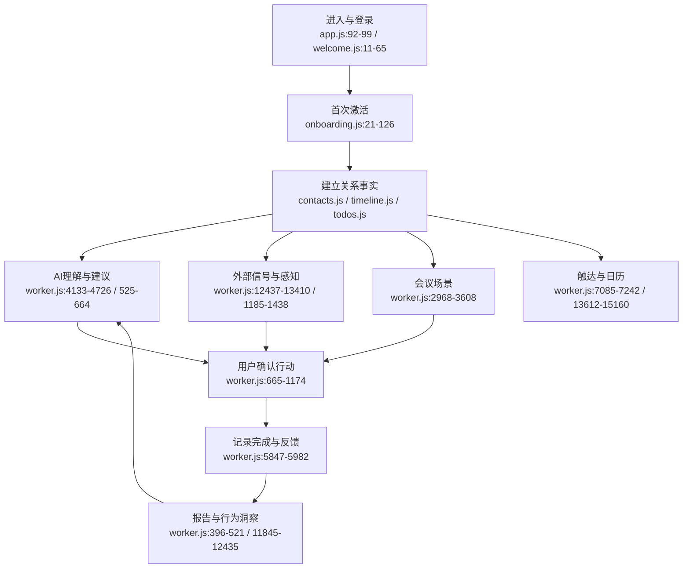

# Welian Feature Boundaries

> 调研日期：2026-08-04
> 目的：为下一版本产品演化与架构收束建立现状地图。

## 边界原则

本次不按页面或 API 数量切分，而按用户价值链和数据流切分。产品当前有 50 个左右的能力点，但可以归并为 8 个可验证的系统域：

1. 身份与激活：用户进入、登录、首次联系人数据冷启动。
2. 关系数据内核：联系人、关系类型、互动、待办、记忆和目标。
3. AI 行动闭环：记/问/拟/报、建议、行动卡、草稿、完成反馈。
4. 感知与信号：外部信号、联系人变化、证据确认和 next-best-action。
5. 会议场景：会前准备、照片提取、会后复盘、跟进事项。
6. 报告与成长：周报/月报/年报、角色仪表盘、进化洞察。
7. 关系网络与分享：连接、路径、场景推荐、社交图谱和分享。
8. 触达与平台服务：订阅消息、Cron、IM、日历、同步、计费和配置。

## Feature inventory

| Feature domain | Entry points | Core files | Purpose | Main dependencies |
|---|---|---|---|---|
| 身份与激活 | `miniprogram/app.js:92-99`; `pages/welcome/welcome.js:11-65`; `pages/onboarding/onboarding.js:21-126` | `miniprogram/utils/api.js:7-74`; `worker.js:9368-9463`, `10058-10146`, `13411-13499` | 微信静默登录、跳过登录、首次添加关系人并获得第一份建议 | 微信 OAuth、KV、dashboard/onboarding |
| 关系数据内核 | `pages/contacts/contacts.js`; `pages/contact-detail/contact-detail.js`; `pages/timeline/timeline.js`; `pages/todos/todos.js` | `worker.js:5984-6224`, `6964-7055`, `7253-7900`; `createContact/createTimelineEntry/createTodo:5706-5767` | 维护 contacts/timeline/todos/memories/goals 等事实数据 | `USER_DATA` KV、认证、数据同步 |
| AI 行动闭环 | dashboard/action card、chat、contact detail | `worker.js:525-1174`, `4133-4726`, `1439-1629`; `pages/dashboard/dashboard.js` | 把关系事实转成“为什么现在、聊什么、做什么、是否完成”的行动 | LLM、metrics、timeline/todos、draft |
| 感知与信号 | `pages/signals/signals.js`; contact detail 感知入口 | `worker.js:12437-13410`, `1185-1438`, `11226-11319` | 从外部信息和低风险传感器发现变化，经过用户确认后进入关系记忆/行动 | RSS/HN/Tavily/GitHub/Web、LLM、perceptions KV |
| 会议场景 | `pages/meetings/meetings.js`; `pages/meeting-detail/meeting-detail.js` | `worker.js:2968-3608`, `10714-10717`, `11012-11027` | 会前准备、拍照提取议程/名片/笔记、会后复盘和跟进 | LLM 多模态、meetings/todos/contacts |
| 报告与成长 | `pages/weekly`, `monthly`, `annual`; dashboard evolution/insights | `worker.js:11845-12435`, `396-521`, `11144-11179`; `pages/dashboard/dashboard.wxml:125-132` | 回顾用户做了什么、关系如何变化、AI 学到了什么 | timeline/todos/metrics、LLM、定时任务 |
| 关系网络与分享 | `pages/network/network.js`; share handlers; report pages | `worker.js:5574-5705`, `10301-10412`, `9465-9525` | 展示用户确认的关系连接、查路径、场景推荐、分享报告 | contacts/connections KV、微信分享 |
| 触达与平台服务 | app config、dashboard sync、Cron、mine/settings | `worker.js:7085-7242`, `11196-11222`, `13612-15160`, `11667-11706`; `app.js:134-223` | 配置、同步、日历 feed、通知偏好、订阅消息、IM、计费和运营控制 | Cloudflare Cron/KV、微信/IM/支付外部 API |

## 主要产品旅程

## 现状判断

- **产品内核已经稳定**：双关系模型、四个动词、事实数据和诚实/伦理约束均有明确实现，见 `docs/SPEC_WELIAN.md:61-181` 与 `AGENTS.md`。
- **能力已经过宽**：Worker 路由从 `worker.js:8956` 延伸到 `worker.js:11400+`，同时覆盖 CRUD、信号、会议、图谱、报告、支付、IM、SDUI 和传感器。
- **主要断点不在“有没有功能”**：R2 计划明确指出行动闭环分散、自进化不可见、主动触达缺少频率控制，见 `docs/SPEC_R2_ACTION_LOOP.md:26-35`。
- **发布风险优先于新增功能**：路线图指出数据恢复、冲突检测、隐私身份关联、Cron 映射和质量门仍是发布前问题，见 `docs/SPEC_WELIAN_ROADMAP_v3.md:59-97`。

## Confidence / gaps

- 高置信：入口、路由、数据集和主要用户旅程均由源代码与现有 Spec 交叉确认。
- 中置信：部分 Web/本地 Agent 旧实现与当前小程序/Worker 主链路并存，功能状态可能存在文档滞后。
- 已知缺口：本次没有读取线上真实激活、留存、付费或行为数据，因此后续 Spec 中的数值应定义为验证门槛，而不是现状成绩。
