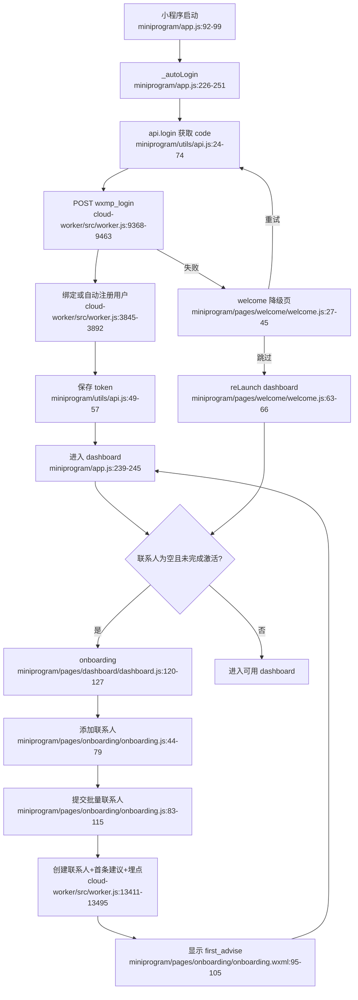

# 身份与激活

## 主路径

## Side effects / external dependencies

- WeChat `wx.login`、微信 jscode2session、Clerk/KV 绑定和用户自动注册。
- onboarding 写入 `contacts:${userId}`，调用 LLM 生成首次建议，写入 metrics，并可能触发邀请奖励/欢迎邮件。
- 登录失败、跳过登录和 onboarding 返回都依赖前端状态/本地 storage，存在回跳和状态持久化耦合。

## 依赖

- 依赖关系数据内核（contacts）。
- 依赖建议和 metrics（首条建议、activation 统计）。
