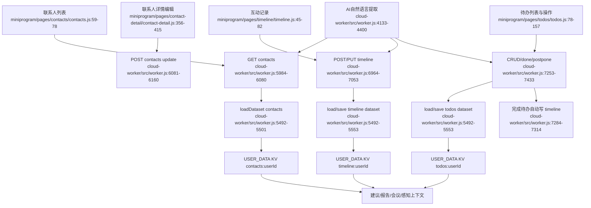

# 关系数据内核

## Side effects / external dependencies

- 三个核心事实集以用户级 KV JSON 数组保存，另有 version sidecar；写入不是多键原子事务（`worker.js:5520-5553`）。
- 前端 CRUD 当前没有统一携带 `expectedVersion`，版本冲突机制存在但未形成端到端闭环。
- contacts 删除会级联 timeline/todos；todo done 会自动生成 timeline，其他入口的事件副作用不完全一致。

## 依赖

- 为所有 AI、报告、会议和通知提供事实上下文。
- 依赖统一事件/metrics 才能正确衡量用户行动。
