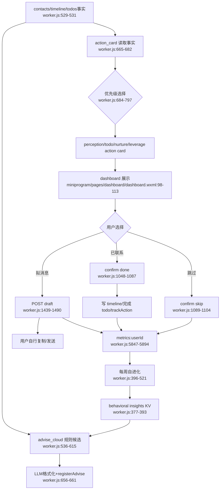

# AI 行动闭环

## 已知断点

- `/data/timeline` 直接 POST、`/data/todos/done`、`extract_intent complete_todo` 与 action card 的 metrics 口径不完全一致（`worker.js:6964-7053`, `7253-7314`, `4352-4380`）。
- action card done 与 todo done 的 timeline/source 副作用不统一。
- 旧式直接 CRUD 行为可能未进入 adoption/北极星指标。
- 行为洞察回流到 prompt，但用户无法看到、纠正或理解改变了什么。

## 依赖

- 依赖关系数据内核、感知、报告和触达。
- 这是下一版本最应该收束的核心系统。
