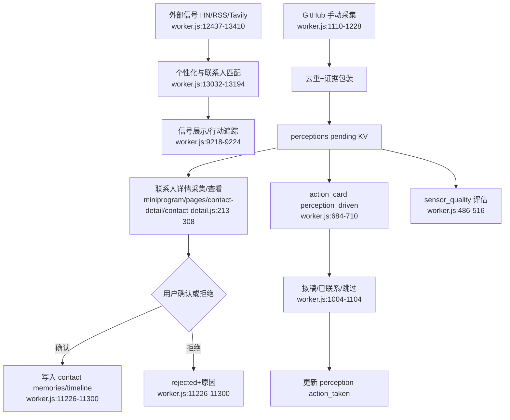

# 感知与信号

## Side effects / external dependencies

- HN/RSS/Tavily/GitHub 等外部来源；LLM 负责相关性和摘要。
- 感知应包含来源 URL、采集时间、原文片段、置信度；确认后才进入记忆或时间线。
- Python 感知层和 ego-browser 设计存在，但尚未全部接入当前 Worker 主链路。

## 已知断点

- 已确认感知的完整撤销路径尚未形成稳定端点/体验。
- 自动采集尚未按质量门控真正扩大，传感器来源和实现存在分叉。
- 感知进入 action card 的优先级高于逾期待办，若没有频率/数量控制可能造成打扰。
