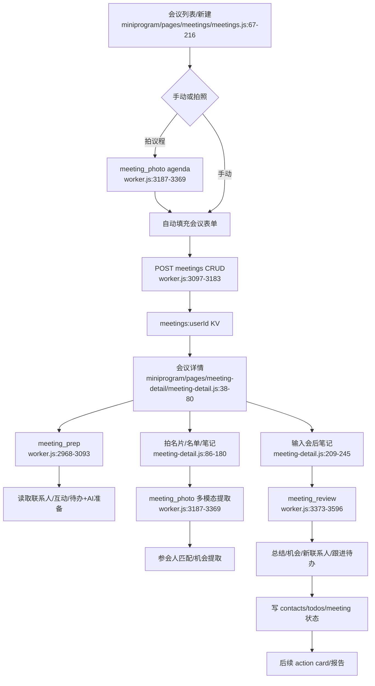

# 会议场景

```mermaid
flowchart TD
  A[会议列表/新建<br/>miniprogram/pages/meetings/meetings.js:67-216] --> B{手动或拍照}
  B -->|拍议程| C[meeting_photo agenda<br/>worker.js:3187-3369]
  C --> D[自动填充会议表单]
  B -->|手动| D
  D --> E[POST meetings CRUD<br/>worker.js:3097-3183]
  E --> F[meetings:userId KV]
  F --> G[会议详情<br/>miniprogram/pages/meeting-detail/meeting-detail.js:38-80]
  G --> H[meeting_prep<br/>worker.js:2968-3093]
  H --> I[读取联系人/互动/待办+AI准备]
  G --> J[拍名片/名单/笔记<br/>meeting-detail.js:86-180]
  J --> K[meeting_photo 多模态提取<br/>worker.js:3187-3369]
  K --> L[参会人匹配/机会提取]
  G --> M[输入会后笔记<br/>meeting-detail.js:209-245]
  M --> N[meeting_review<br/>worker.js:3373-3596]
  N --> O[总结/机会/新联系人/跟进待办]
  O --> P[写 contacts/todos/meeting 状态]
  P --> Q[后续 action card/报告]
```

## Side effects / external dependencies

- 多模态 LLM；会议、联系人、待办三个数据集写入。
- 会后复盘可自动创建联系人和跟进待办，并自动完成匹配的会议前待办。
- 会议已有完整的关系行动潜力，但目前是独立入口，尚未统一到 action card 的单一行动对象。
