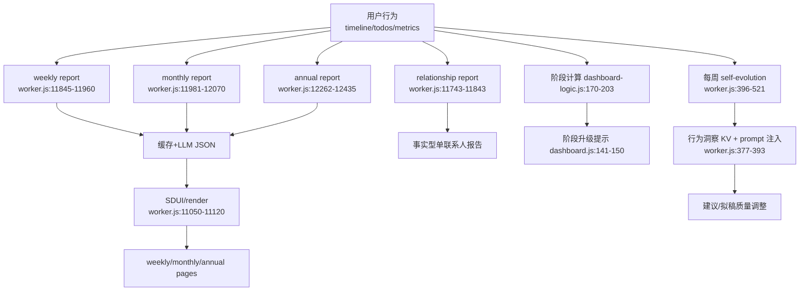

# 报告与成长

```mermaid
flowchart TD
  A[用户行为<br/>timeline/todos/metrics] --> B[weekly report<br/>worker.js:11845-11960]
  A --> C[monthly report<br/>worker.js:11981-12070]
  A --> D[annual report<br/>worker.js:12262-12435]
  A --> E[relationship report<br/>worker.js:11743-11843]
  B --> F[缓存+LLM JSON]
  C --> F
  D --> F
  E --> G[事实型单联系人报告]
  F --> H[SDUI/render<br/>worker.js:11050-11120]
  H --> I[weekly/monthly/annual pages]
  A --> J[阶段计算 dashboard-logic.js:170-203]
  J --> K[阶段升级提示 dashboard.js:141-150]
  A --> L[每周 self-evolution<br/>worker.js:396-521]
  L --> M[行为洞察 KV + prompt 注入<br/>worker.js:377-393]
  M --> N[建议/拟稿质量调整]
```

## 已知断点

- 周报/月报/年报分别计算相近指标，时间范围、完成率和角色分类口径不完全统一。
- 行为洞察的生成与注入已实现，但用户端解释、确认、编辑、重置的产品闭环仍不完整。
- 阶段升级提示依赖本地 storage，跨设备/清缓存后体验和状态一致性不稳定。
- 报告更多是回顾输出，回到行动的 CTA 不统一。
