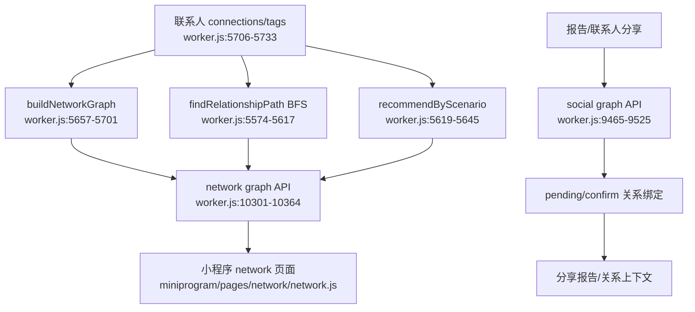

# 关系网络与分享

## Side effects / external dependencies

- 图谱只使用联系人字段中明确存在的 connections/tags；陪伴型关系不进入路径和图谱计算。
- 分享/社交绑定涉及微信 openid、联系人姓名和邀请关系，必须使用 opaque ID、显式确认和可撤销机制。
- 当前网络能力已有后端算法和小程序列表入口，但图谱可视化不是下一版本首要价值证明。
