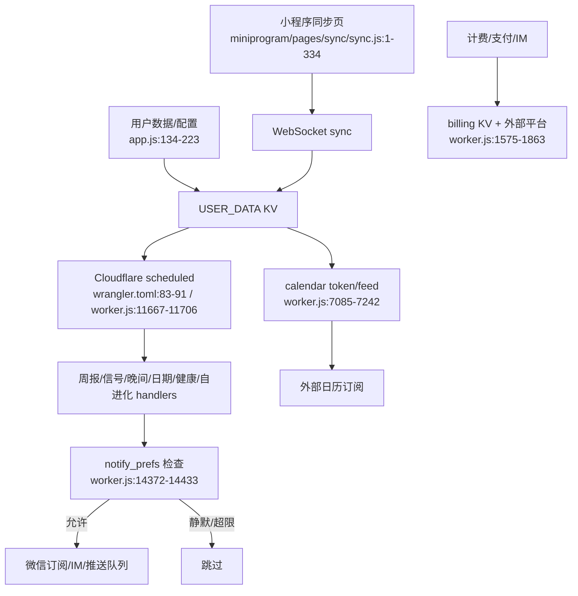

# 触达与平台服务

## 已知断点 / 风险

- 多个 Cron 都可能触达同一用户；已有 prefs 和每日上限，但时区、失败重试、全局熔断仍需收口。
- 日历 token/feed 有独立设计，但撤销、访问频率和审计需要成为产品信任能力。
- IM session、计费和 KV 多键写入存在并发/可靠性风险。
- 平台能力应服务于“每周一次有意义的关系行动”，不应继续作为功能数量增长的主线。
