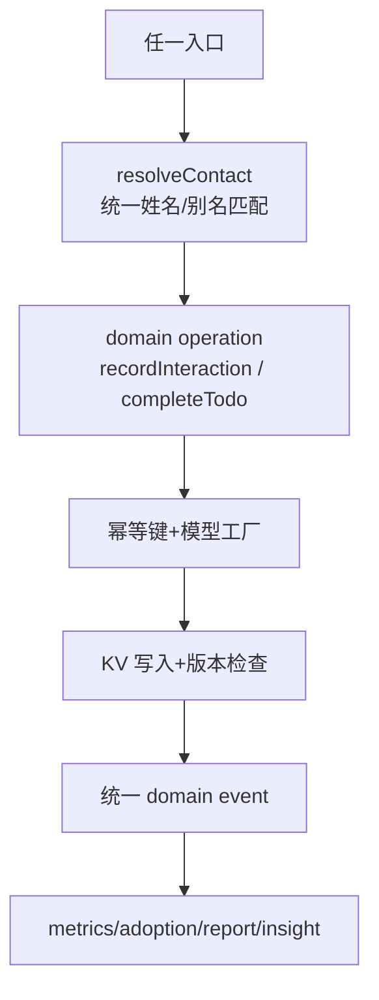
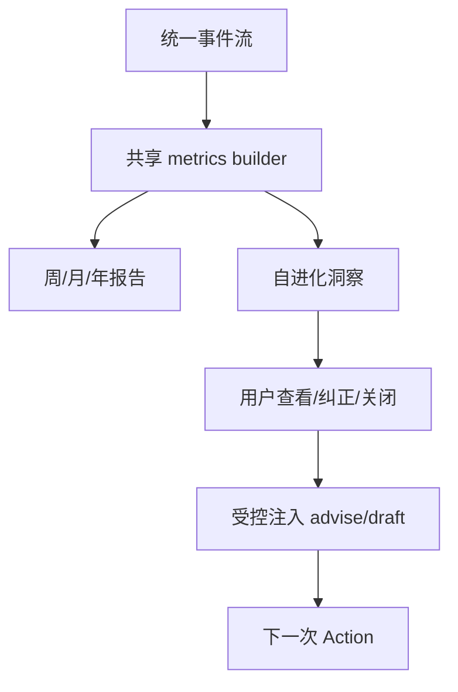

# Welian Unified Proposal

## 结论

下一版本不增加另一套“关系操作系统平台层”，而是把现有能力统一到一个更小、更可验证的核心：

> **关系行动内核（Relationship Action Kernel）**：所有关系事实都通过统一写入操作进入系统；所有建议、信号、会议和待办都产出同一种可追踪的 Action；所有用户结果都进入统一事件流；报告和 AI 洞察只消费这条可信事件流。

## 统一系统 1：事实写入与事件流

### Target component

- Domain operations：`recordInteraction`、`completeTodo`、`resolveContact`
- Event entry：`trackAction` 标准化为唯一事件记录器

### Old call sites

- `worker.js:7012-7018` timeline POST
- `worker.js:7297-7312` todo done
- `worker.js:1056-1076` action card done
- `worker.js:4295-4302, 4352-4380` extract intent
- `worker.js:8167-8179, 9928-9942` sync paths
- `worker.js:10526-10533` chat import

### Proposed flow



### Acceptable loss

- 不保留“某个入口悄悄写入但不记 metrics”的行为；这会改变历史统计口径，但属于修复。
- 保留不同 `source` 值，用于审计和产品分析；不保留不同写入实现。

## 统一系统 2：关系候选与 Action

### Target component

- `selectRelationshipCandidates(context, policy)`：共享候选生成。
- `Action`：统一表示 signal/todo/meeting/advise/perception 驱动的行动。

### Old call sites

- `worker.js:536-615` advise_cloud 内联候选
- `worker.js:665-797` action card
- `worker.js:3373-3596` meeting review follow-ups
- `worker.js:684-710` perception-driven action
- `worker.js:1439-1490` draft

### Proposed Action shape

```json
{
  "id": "act_xxx",
  "type": "advise|todo_due|meeting_followup|perception_driven|nurture",
  "contact_id": "c_xxx",
  "nature": "leverage|nurture|dual",
  "reason": "为什么现在",
  "suggested_topic": "基于已知事实的话题",
  "source": {"kind": "timeline|todo|meeting|perception|date", "id": "..."},
  "available_actions": ["draft", "record_done", "snooze", "skip"],
  "status": "presented|accepted|done|skipped|expired",
  "created_at": "..."
}
```

### Ethics guard

- leverage/dual 可以有内部优先级，但不向用户暴露“人价值分数”。
- nurture 只由重要日期、记忆和在场语境触发；不使用冷却、ROI、排序。
- pending perception 先进入“证据确认”，确认前不能直接成为可执行行动。

### Acceptable loss

- 取消 `advise_cloud` 与 action card 的两套阈值和随机扰动；推荐可解释性和一致性优先。
- 会议、信号和感知保留各自的采集体验，但输出统一 Action。

## 统一系统 3：报告与可解释学习

### Target component

- `buildRelationshipMetrics(range, datasets)`：共享时间过滤、角色分类、关系状态和计数。
- `EvolutionInsight`：用户可见、可校正的洞察对象。

### Old call sites

- `worker.js:11845-11960` weekly
- `worker.js:11981-12070` monthly
- `worker.js:12262-12435` annual
- `worker.js:13697-13796` health warning
- `worker.js:396-521` self evolution
- `worker.js:11144-11180` evolution API

### Proposed insight shape

```json
{
  "id": "ins_xxx",
  "summary": "你更容易完成有明确联系人和下一步的建议",
  "evidence": [
    {"metric": "action_adoption", "value": 0.35, "range": "最近4周"}
  ],
  "effect": "后续建议会优先给出一个具体联系人和一个可执行动作",
  "status": "active|dismissed|corrected",
  "updated_at": "..."
}
```

### Proposed flow



### Acceptable loss

- 不再允许只存一段不可解释 Markdown 并隐式改变所有建议；必须保留依据和状态。
- 报告的具体文案、周期和版式可以继续不同。

## 统一系统 4：通知分发

### Target component

- `dispatchNotification({ userId, category, payload, dedupeKey })`

### Old call sites

- `worker.js:13796-13800` health warning
- `worker.js:13945-13948` festival reminder
- `worker.js:14435-14471` daily signals
- `worker.js:13964-14276` weekly push
- `worker.js:15160-15212` subscribe message
- `worker.js:14372-14433` prefs/count

### Proposed responsibility

单一出口统一完成：用户偏好、静默时段、每日上限、幂等、队列写入、渠道分发和失败记录。Cron handler 只负责产生候选通知。

### Acceptable loss

- 不保留各 handler 自己控制计数和队列的特殊实现；保留 category 和渠道差异。

## 发布顺序

1. 可信事实写入与事件流。
2. 统一 Action 和候选选择。
3. 可解释报告/自进化。
4. 统一触达。
5. 感知、会议和信号逐个接入 Action，不新增并行闭环。
