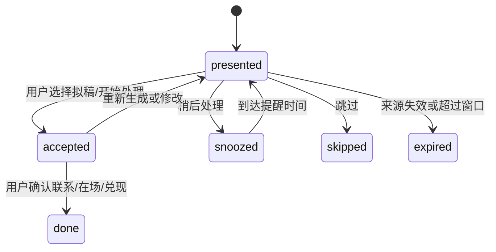

# Welian 下一版本产品规约

> **下一版本不是再增加一个功能，而是让已有能力收束成一个可信的用户闭环。**
>
> Welian 帮用户把“我应该对谁用心、现在为什么、下一步做什么”变成一个由用户确认、可以完成、能够回顾的关系行动。

---

## 0. 决策摘要

### 0.1 下一版本的产品定位

**推荐定位：**

> **Welian 是一个以事实为依据、每周帮助你完成一件重要关系行动的个人关系智能体。**

**对外短句：**

> **小维不替你维系关系，只帮你记得、想清楚，然后动起来。**

### 0.2 为什么不继续沿用“关系操作系统”作为主叙事

“关系操作系统”适合作为长期架构愿景，但当前产品已经拥有联系人、互动、待办、会议、信号、感知、报告、网络、推送、支付和多端同步等大量能力。现阶段缺的不是系统服务，而是：

1. 同一个用户行为从不同入口写入后，事件和指标口径不一致；
2. 建议、行动卡、会议跟进、感知和待办各自形成闭环，用户需要自己拼接；
3. AI 洞察已经在后台改变 Prompt，但用户看不到依据，也无法纠正；
4. 推送能力很多，但还没有形成“少而有用”的触达策略；
5. 数据版本、并发写入、身份关联和恢复能力仍影响可信度。

因此，本版本把“关系操作系统”收束为一个可验证的产品承诺：**关系行动闭环**。平台化、图谱生态、MCP 和更多外部来源暂不作为主线。

### 0.3 版本目标

在不改变 Welian 双关系伦理内核的前提下，完成以下跃迁：

```text
分散的事实输入
  → 统一的关系事实
  → 一个当前最值得做的行动
  → 用户确认/执行
  → 结果记录
  → 可解释的个性化反馈
```

### 0.4 本版本的北极星

> **每周被用户确认完成的关系行动数**

“生成建议”“打开页面”“生成草稿”都不是关系行动本身；只有用户确认已经联系、陪伴、兑现、到场或完成跟进，才计入北极星。

---

## 1. 调研结论与现状判断

### 1.1 已验证的产品资产

| 资产 | 当前证据 | 对下一版的意义 |
|---|---|---|
| 双关系模型 | `docs/SPEC_WELIAN.md:92-181`；Worker 多处使用 `normalizeNature` | 继续作为不可破坏的伦理内核 |
| 记/问/拟/报/会 | `docs/SPEC_WELIAN.md:236-243`；小程序已有互动、待办、会议、报告页 | 不新增动词，改为统一行动流 |
| 首次激活 | `pages/onboarding`；`worker.js:13411-13495` | 作为首个价值入口，目标是 3 分钟内获得第一份建议 |
| 行动卡 | `worker.js:665-797`、`1004-1104`；dashboard 已有操作按钮 | 作为全产品唯一“下一步行动”出口 |
| 感知和信号 | `worker.js:1110-1228`、`12437-13410`；`SPEC_R3_PERCEPTION.md` | 先做证据确认，再接入行动卡 |
| 会议闭环 | `worker.js:2968-3596`；小程序 meetings/meeting-detail | 会后跟进输出必须进入统一 Action |
| 报告与自进化 | `worker.js:11845-12435`、`396-521` | 从后台生成文字，升级为用户可理解的反馈 |
| 触达能力 | `wrangler.toml:83-91`、`worker.js:13612-15160` | 统一调度，不再继续增加通知类型 |

### 1.2 当前主要断点

| 断点 | 证据 | 产品影响 | 版本处理 |
|---|---|---|---|
| 多入口写入 | `worker.js:7012-7018`、`7297-7312`、`1056-1076`、`4295-4380` | 互动和完成行为可能不进 metrics，行动闭环无法衡量 | P0 统一 domain write + event |
| 候选逻辑分叉 | `worker.js:536-615` 与 `801-931` | advise 和 action card 可能给出不同推荐 | P0 统一候选策略 |
| 联系人匹配分叉 | `worker.js:4283-4313`、`4366`、`8158-8179`、`9921-9942` | 昵称/别名在不同入口行为不同 | P0 单一 resolveContact |
| 写入副作用不一致 | `worker.js:7297-7312` 与 `1056-1065` | todo 完成是否写互动记录取决于入口 | P0 统一操作与幂等 |
| 自进化不可解释 | `worker.js:377-393`、`396-521`、`11144-11180` | 用户不知道 AI 学到了什么，无法校正 | P1 结构化 EvolutionInsight |
| 触达分散 | `worker.js:13796-13800`、`13945-13948`、`14435-14471` | 频率、静默和幂等容易漏控 | P1 单一通知出口 |
| 数据并发与恢复 | `worker.js:5520-5553`；`docs/SPEC_WELIAN_ROADMAP_v3.md:79-89` | 多端更新可能丢失，数据可信度下降 | P0 版本、幂等、快照和恢复演练 |
| 阶段弹窗干扰 | `pages/dashboard/dashboard.js:141-150`、dashboard WXML 弹窗 | 成长反馈打断主要任务 | P1 改为非阻塞里程碑 |

### 1.3 当前不应继续扩大的方向

基于 `docs/SPEC_WELIAN_ROADMAP_v3.md:12-20, 68-97, 99-245` 的研究结论，本版本暂缓：

- 更多信号源；
- 关系图谱视觉化和引荐路径扩张；
- MCP/技能市场/第三方开发者生态；
- 团队协作和企业版；
- 自动采集联系人外部信息；
- 自动发消息、自动点赞、自动添加好友；
- 用更多成长阶段、分数或排行榜刺激使用。

这些能力不是永久取消，而是必须等核心行动闭环和数据质量达到退出门槛后再评估。

---

## 2. 用户与问题定义

### 2.1 主用户

**P0：关系密集型职业人**

销售、BD、猎头、创业者、投资人、顾问、律师以及跨多个圈层工作的管理者。其核心问题不是没有联系人，而是：

- 互动后没有及时留下可用记忆；
- 答应过的事容易遗忘；
- 重要关系和普通待办混在一起；
- 不知道现在联系谁、为什么联系、怎么开口；
- 关系数据分散在通讯录、聊天、日历和脑内。

### 2.2 次用户

**P1：重视关系质量的普通用户**

家人、挚友、恩师和长期朋友是重要使用场景，但不能被包装成“效率提升”或“关系投资”。对这部分用户，产品价值是记得重要时刻、保留真实记忆、帮助用户更自然地在场。

### 2.3 不以本版本为目标的用户

- 需要团队共享 CRM、销售漏斗和组织权限的企业客户；
- 想自动获取陌生人、批量爬取社交平台或自动触达的人；
- 只需要一个简单通讯录、不愿记录任何事实的人。

### 2.4 用户核心任务

| 时刻 | 用户想完成什么 | Welian 的响应 |
|---|---|---|
| 刚见完面 | 快速记住发生了什么 | 自然语言记录，提取互动和待办，用户确认后保存 |
| 准备联系前 | 回忆上次谈了什么 | 给出最近事实、待兑现事项和一个自然话题 |
| 不知道联系谁 | 找到当前最有理由行动的人 | 只给一个可解释 Action，不给无穷列表 |
| 有外部变化 | 判断是否值得关注 | 先显示来源和证据，用户确认后才进入关系数据 |
| 会议结束后 | 把机会变成跟进 | 复盘提取联系人、互动和待办，统一进入 Action 队列 |
| 一周结束 | 知道自己实际做了什么 | 行为回顾 + 一个下周行动，不做幸福评分 |

---

## 3. 产品原则

### P1. 行动优先，不是数据堆积

每个核心页面都回答“下一步是什么”，而不是把更多统计卡片堆到 dashboard。

### P2. 一次只给一个最值得做的行动

行动卡可以有多个来源，但同一时刻只展示一个主行动。用户跳过后再给下一个，不同时轰炸多个建议。

### P3. 事实与推断分离

联系人资料、互动记录、待办和用户确认的感知属于事实；AI 生成的话题、优先级和洞察属于推断。界面必须能区分两者，并展示依据。

### P4. 用户确认是关系数据的写入边界

AI 可以提取、总结和提出建议，但未经用户确认不应把外部感知写入记忆，也不应自动发送消息或替用户完成社交行为。

### P5. 双关系伦理不可折损

- **经营型/双重关系**：可根据目标、待办和上下文形成内部优先级；不向用户暴露“人的价值分数”。
- **陪伴型关系**：只使用重要日期、记忆和在场语境；不使用冷却、ROI、排序、产出或完成率。
- **双重关系**：合作议题和私人情谊分区处理，不自动改类。

### P6. 低打扰是主动性的前提

主动提醒必须有明确原因、来源、行动出口和关闭/静默能力。成长提示不应覆盖 tab bar，不应阻塞用户主任务。

### P7. 后端配置文案，前端稳定交互

继续使用 `/ai/config` 驱动阈值、文案和 feature flag；但联系人、待办、互动和聊天等有状态核心交互不通过未经验证的 SDUI 替代原生页面。该边界沿用 `docs/SPEC_WELIAN_ROADMAP_v3.md:114-117`。

### P8. 指标必须来自事实写入

不以页面打开、LLM 调用次数或“看过建议”冒充关系行动。所有事实写入必须有标准事件、来源、幂等键和可回溯关系。

---

## 4. 下一版本范围

### 4.1 P0：可信关系内核

#### P0-1 统一联系人解析

所有自然语言、导入、会议和同步入口调用单一 `resolveContact`：

- 精确姓名；
- 姓名包含匹配；
- `aliases` 和旧字段 `alias`；
- 多个候选时返回歧义，不静默写错；
- 找不到时不编造联系人。

#### P0-2 统一事实写入

建立三个领域操作：

```text
recordInteraction(contact, content, source)
completeTodo(todo, source)
upsertContact(contact, source)
```

每个操作统一负责：

- 使用模型工厂创建数据；
- 规范化日期、nature、source；
- 幂等检查；
- 数据集版本检查；
- 成功后产生标准事件；
- 需要时生成关联 timeline；
- 失败时不覆盖原数据。

#### P0-3 统一事件口径

保留 `trackAction` 的能力，但将事件标准化为：

```json
{
  "event_id": "evt_xxx",
  "event_type": "interaction_recorded|todo_completed|draft_generated|action_skipped|onboarding_completed|perception_confirmed",
  "source": "timeline|chat|action_card|meeting|import|sync",
  "contact_id": "c_xxx",
  "action_id": "act_xxx",
  "occurred_at": "2026-08-04T10:00:00Z",
  "meta": {}
}
```

事件记录规则：

- 同一个 `event_id` 只计一次；
- `draft_generated` 不等于关系行动完成；
- `todo_completed`、`interaction_recorded` 和用户确认的 presence action 才能进入北极星；
- 事件失败不应阻塞用户已经完成的事实写入，但必须进入错误监控。

#### P0-4 数据可信与恢复

- 所有关键写入支持 `expectedVersion` 或等价的幂等机制；
- schema 增加版本号和迁移入口；
- JSON 解析失败时停止写入并报警；
- 提供用户全量导出；
- 对联系人/互动/待办做定期快照；
- 完成一次恢复演练；
- 关键多数据集操作定义部分成功和重试语义。

### 4.2 P1：统一关系 Action

#### 4.2.1 Action 定义

所有“建议联系谁”“待办到期”“会议跟进”“信号匹配”“感知变化”和“陪伴提醒”都输出同一结构。`source.kind` 必须使用下列明确枚举；其中 `candidate` 表示没有单一原始来源时，由已存联系人、互动、待办或其他事实计算出的派生候选来源，`evidence` 仍需说明计算依据：

```json
{
  "id": "act_xxx",
  "type": "advise|todo_due|meeting_followup|signal_match|perception_driven|nurture",
  "contact": {"id": "c_xxx", "name": "张三", "nature": "leverage"},
  "reason": "为什么是现在",
  "suggested_topic": "建议聊什么或做什么",
  "source": {
    "kind": "timeline|todo|meeting|signal|perception|important_date|candidate",
    "id": "source_xxx",
    "evidence": "依据摘要"
  },
  "available_actions": ["draft", "record_done", "snooze", "skip"],
  "status": "presented|accepted|done|snoozed|skipped|expired",
  "created_at": "2026-08-04T10:00:00Z"
}
```

#### 4.2.2 候选策略

- `advise_cloud` 和 `action_card` 使用同一候选生成规则；
- 只在内部计算候选优先级，界面展示原因，不展示分数；
- 去除不可解释的随机扰动；
- 同一 Action 在同一周期内幂等；
- 没有高置信行动时，返回“目前没有特别需要做的事”，不强行制造行动。

#### 4.2.3 Action 状态机



#### 4.2.4 会议与感知接入

- 会议复盘产生的 follow-up todo 必须同时产生 `meeting_followup` Action；
- pending perception 先进入证据确认，不直接成为可执行 Action；
- perception confirm 后才可以生成 `perception_driven` Action；
- 所有 Action 的完成都通过统一 domain operation 写入 timeline/todo，并记录 source。

### 4.3 P1：可解释的 AI 洞察

当前 `prompt:behavioral_insights:{userId}.md` 不能作为唯一用户可见模型。改为结构化：

```json
{
  "id": "ins_xxx",
  "summary": "你更容易完成有明确联系人和下一步的建议",
  "evidence": [
    {"metric": "action_adoption", "value": 0.35, "range": "最近4周", "sample": 23}
  ],
  "effect": "后续建议优先给出一个具体联系人和一个可执行动作",
  "status": "active|dismissed|corrected",
  "updated_at": "2026-08-04T10:00:00Z"
}
```

用户可：

- 查看“学到了什么”；
- 查看依据时间范围和样本量；
- 纠正或关闭某条洞察；
- 一键重置全部洞察。

LLM 只能生成 summary/effect 文案；metric、sample、range 必须由确定性代码计算。

### 4.4 P1：克制的统一触达

所有定时任务、订阅消息和 IM 消息先产生 `NotificationIntent`，再由唯一出口分发：

```json
{
  "user_id": "user_xxx",
  "category": "action|todo_due|important_date|weekly_report|signal",
  "action_id": "act_xxx",
  "dedupe_key": "todo_due:todo_xxx:2026-08-04",
  "priority": "normal|high",
  "payload": {}
}
```

默认策略：

- 每日关系行动类通知最多 1 条；
- 每日全部通知不超过用户设置的上限，默认不超过 3 条；
- 支持分类关闭、静默时段和一键暂停；
- 失败有记录和有限重试，不重复扣减订阅次数；
- 每条通知必须可以回到一个 Action、待办、重要日期或报告。

### 4.5 P2：证据优先的感知试点

本版本只保留低风险、用户主动开启的感知：

- GitHub 公开活动；
- 用户指定网页；
- 已有信号与联系人公司的相关匹配。

每条感知必须有：来源 URL、平台、采集时间、原文片段、置信度、确认/拒绝/撤销状态。没有出处的感知不进入联系人记忆，也不进入 Action。

### 4.6 P2：成长反馈改为非阻塞

“进化阶段”保留为轻量成长叙事，但不再用阻塞式弹窗打断用户：

- dashboard 内联展示当前阶段和进展；
- 阶段升级只显示一次非阻塞 toast 或卡片；
- 不遮挡 tab bar 和主操作按钮；
- 进化阶段不是价值排名，也不要求用户追逐固定数字；
- 用户可以关闭成长提示。

---

## 5. 端到端用户旅程

### 5.1 激活：3 分钟内获得第一份价值

```text
打开小程序
  → 自动登录或明确的访客/稍后登录路径
  → 添加 3 位重要的人（姓名 + 关系类型即可）
  → 获得第一张基于真实联系人数据的 Action
  → 用户可以拟稿、记录已联系或稍后处理
```

成功标准：

- 登录失败不能把用户困在登录页；
- 跳过/返回不会再次触发 onboarding 死循环；
- 3 位联系人提交后返回 `first_advise`；
- 首个价值时间可由事件计算，不靠页面猜测。

### 5.2 互动后：10 秒记录

```text
用户输入：“记一下，今天和张三聊了预算，下周给他发方案”
  → AI 提取联系人、互动摘要、待办
  → 展示待确认预览
  → 用户确认
  → recordInteraction + createTodo
  → 生成一个可回到行动队列的 Action
```

### 5.3 本周行动

Dashboard 只展示一张主 Action：

- 为什么现在；
- 对应谁；
- 建议聊什么；
- 依据是什么；
- 用户选择“拟一条消息”“我已完成”“稍后”“跳过”。

“拟一条消息”只负责生成草稿和复制，不负责发送；用户发送后可回到 Welian 确认结果。

### 5.4 会议闭环

```text
会议前准备
  → 拍议程/名片/笔记
  → 会前上下文
  → 会后复盘
  → 新联系人/互动/跟进待办
  → 统一 Action 队列
```

会议页保留专业能力，但不再产生第二个独立的跟进系统。

### 5.5 陪伴型关系

例：妈妈生日还有 3 天。

系统可以说：

> “妈妈的生日还有 3 天。要不要提前想一句想对她说的话？”

系统不能说：

- “妈妈已经 30 天没有联系”；
- “本月陪伴完成率下降”；
- “家人关系排名”；
- “联系妈妈的 ROI”。

### 5.6 周报与进化

周报先陈述事实，再给一个可选行动：

```text
过去一周：记录了 4 次互动，完成了 2 个跟进。
小维学到：你更容易完成有明确联系人和话题的建议。
依据：过去 4 周，23 个行动中有 8 个被确认完成。
下周可以先做：给李四发上次答应的方案。
```

用户可以接受、忽略或纠正，不把报告当成评判。

---

## 6. AI 行为契约

### 6.1 确定性逻辑与 LLM 分工

| 逻辑 | 实现方式 |
|---|---|
| 联系人匹配、日期、状态、去重、权限、指标 | 确定性代码 |
| nature 伦理边界 | 确定性护栏 + Prompt 双重保护 |
| 文本摘要、建议话题、消息草稿 | LLM，可 fallback |
| 行为指标、样本量、完成率、采纳率 | 确定性代码，不由 LLM 计算 |
| 行为洞察文案 | LLM 基于结构化指标生成，但必须附 evidence |

### 6.2 诚实与证据

- 只引用联系人、互动、待办、会议和用户确认感知中存在的事实；
- 外部感知必须显示出处；
- 没有资料时明确说“没有找到相关记录”；
- 低置信度时先询问，不把推断写成事实；
- 每条行动建议都能回溯到至少一个 source。

### 6.3 伦理护栏

- **不自动点赞、不自动加好友**；
- **不自动发送私聊消息**——私聊代表一对一的私人关系，用心不可自动化；
- **群聊自动回复需满足以下全部条件**（缺一不可）：
  1. 用户明确启用了该群的自动回复（群白名单，默认关闭）；
  2. 满足触发条件（@小维 或用户配置的关键词），不是对所有消息自动回复；
  3. 遵守频率限制（每群每小时上限、每日上限、最小间隔）；
  4. 用户可随时一键关闭，关闭后立即停止；
  5. 回复内容标注"AI生成"前缀，不伪装成人类发言；
  6. 不在群内自动发起私聊、不自动加群成员为好友；
- 不对陪伴型关系做冷却、排序、ROI、完成率或产出评估；
- 不根据分享链接隐式绑定双方身份；
- 不把用户的关系网络出售、公开或用于陌生人发现。

---

## 7. 数据与 API 目标契约

### 7.1 数据集边界

| 数据集 | 责任 |
|---|---|
| contacts | 联系人事实、nature、关系属性、来源 |
| timeline | 已发生的互动事实 |
| todos | 用户确认要做的关系行动 |
| meetings | 会议事实和复盘来源 |
| perceptions | 尚待用户确认的外部变化 |
| actions | 当前/历史统一行动对象 |
| domain_events | 事实写入和用户结果事件 |
| evolution_insights | 可解释的个性化洞察 |
| notify_prefs | 用户触达偏好 |

### 7.2 现有 API 的目标演化

| 现有 API | 下一版本要求 |
|---|---|
| `/data/timeline` | 写入统一走 `recordInteraction`，返回 `event_id`/`version` |
| `/data/todos/done` | 与 action card done 使用同一 `completeTodo`，统一生成关联 timeline 和事件 |
| `/ai/extract_intent` | 保留自然语言入口；对批量提取提供预览/确认语义 |
| `/ai/action_card` | 返回规范化 Action，包含 source、status、available_actions |
| `/ai/action_card/confirm` | 接收 `action_id`、`action`、`idempotency_key`，重复请求返回同一结果 |
| `/ai/evolution` | 返回结构化 insights/evidence/effect，不再只返回 Markdown 字符串 |
| `/ai/notify_prefs` | 继续作为用户设置入口，所有发送路径必须调用统一 dispatcher |
| `/ai/perceptions/*` | 确认前只保留 pending；补齐已确认感知撤销和审计 |

目标是在保持旧客户端兼容的前提下逐步迁移，禁止为每个来源增加一套新 Action API。

---

## 8. 指标与验收门槛

### 8.1 产品指标定义

| 指标 | 定义 | 目标/用途 |
|---|---|---|
| 首个价值时间 | 登录成功到首次看到基于真实联系人生成的 Action 的时间 | 中位数 < 3 分钟 |
| 7 日激活率 | 注册后 7 日内添加 ≥3 联系人且完成 ≥1 个核心行动 | ≥40% |
| 每周关系行动数 | 用户确认完成的 interaction/todo/presence action 数 | 北极星，持续上升 |
| Action 采纳率 | presented 后 7 日内进入 accepted/done 的比例 | ≥15%，不把展示当采纳 |
| D30 留存 | 第 30 天仍完成任一核心行动的用户比例 | ≥20% |
| 事实事件覆盖率 | 成功写入事实后存在对应 domain event 的比例 | 目标 ≥99% |
| Action 幂等率 | 重试不产生重复 action/timeline/todo 的比例 | 目标 100% |
| 感知证据覆盖率 | 有来源、时间、原文和置信度的感知比例 | 目标 100% |
| 自动社交行为数 | 未经用户确认的发送/点赞/加好友次数 | 必须为 0 |

### 8.2 指标边界

- 待办完成率只描述用户创建的待办中已完成的比例，不等于建议采纳率；
- 建议采纳率必须基于具体 `action_id` 和时间窗口，不用“最近一次建议”粗略归因；
- 陪伴型关系只记录用户实际在场/互动事实，不生成关系质量分数；
- 没有样本量的百分比不展示给用户；
- 指标不能由 LLM 自由计算。

### 8.3 发布阻断门

1. 登录 → 激活 → 记录互动 → 生成 Action → 用户确认完成的真机旅程通过；
2. 直接 CRUD、自然语言、会议复盘和行动卡写入同一事件口径；
3. metrics 覆盖率和 Action 幂等测试通过；
4. 数据损坏不覆盖原数据，恢复演练通过；
5. 感知确认/拒绝/撤销和分享身份同意测试通过；
6. 通知偏好、静默时段、每日上限、重复触发和渠道失败测试通过；
7. dashboard 任何成长提示不遮挡 tab bar、不阻塞主操作；
8. Vitest、Python tests、Journey tests、Automator 关键旅程全部通过；
9. 没有未经用户确认的自动社交行为。

---

## 9. 分阶段实施路线

### R0：可信内核

范围：统一联系人解析、事实写入、事件、幂等、版本、恢复、指标覆盖。

不新增用户可见大功能。先让现有能力的数据可信。

退出门：事件覆盖、幂等、恢复演练、关键旅程和质量门全部通过。

### R1：每周一个行动

范围：统一 Action、候选策略、dashboard 主 Action、会议 follow-up 接入、自然语言记录后的行动回流。

退出门：用户能从真实事实进入一个行动，并确认完成或稍后处理；建议到行动转化达到目标。

### R2：看得懂的自进化与克制触达

范围：结构化 EvolutionInsight、用户反馈、统一 NotificationDispatcher、非阻塞成长反馈。

退出门：用户可以解释 AI 为什么这样建议，可以关闭洞察和通知；重复推送和遮挡问题归零。

### R3：感知 Alpha

范围：手动 GitHub/指定网页/已有信号匹配；证据卡；用户确认后才形成 Action。

退出门：感知确认准确率 ≥90%、感知到行动转化 ≥20%、所有感知可撤销。

### 后续评估，不属于本版本主线

- 关系图谱可视化；
- 更多外部信号源；
- MCP/开发者生态；
- 团队协作；
- 自动采集和自动触达；
- 独立 App。

---

## 10. 成功与失败的判定

### 成功

用户不需要理解 Welian 的所有功能，只需要在一次互动后留下事实，下一次打开时看到一个有依据、不过度打扰、可以完成的行动；完成后系统能准确记录，并在下次更懂用户。

### 失败

- dashboard 充满卡片，但用户不知道现在做什么；
- AI 洞察很会写，却无法说明依据；
- 同一个待办从不同入口完成后产生不同数据；
- 通知很多，但没有行动出口；
- 用陪伴型关系的“完成率”或“冷却天数”制造焦虑；
- 为了增长继续扩展信号、图谱和平台，却没有改善每周关系行动数。

---

## 11. 最终产品决策

1. **定位从“关系操作系统”落到“关系行动智能体”。** 前者保留为架构愿景，后者作为当前用户承诺。
2. **下一版本以 R0 + R1 为发布核心，R2 为增强，R3 为明确 opt-in 实验。**
3. **统一 Action 是产品主线，统一事实写入和事件流是技术前提。**
4. **感知、会议、信号、报告都必须接入同一个 Action，而不是继续各自生长。**
5. **所有成长和 AI 洞察都要非阻塞、可解释、可关闭。**
6. **关系伦理、数据主权、用户确认和不自动社交是版本不变量。**

---

## 附录 A：实现参考

- 产品使命与双关系模型：`docs/SPEC_WELIAN.md:61-181`
- 获客/激活/留存漏斗：`docs/SPEC_WELIAN.md:245-285`
- 现状优先级与 R1/R2/R3 路线：`docs/SPEC_WELIAN_ROADMAP_v3.md:59-245`
- 行动闭环设计：`docs/SPEC_R2_ACTION_LOOP.md:84-245`
- 可解释感知设计：`docs/SPEC_R3_PERCEPTION.md:42-134`
- 关系数据写入与版本：`cloud-worker/src/worker.js:5492-5553`
- 候选与 Action：`cloud-worker/src/worker.js:525-1104`
- metrics 与自进化：`cloud-worker/src/worker.js:377-521,5768-5978`
- 报告：`cloud-worker/src/worker.js:11743-12435`
- 触达配置与 Cron：`cloud-worker/wrangler.toml:83-91`; `cloud-worker/src/worker.js:14372-15160`

**最后更新**：2026-08-04
